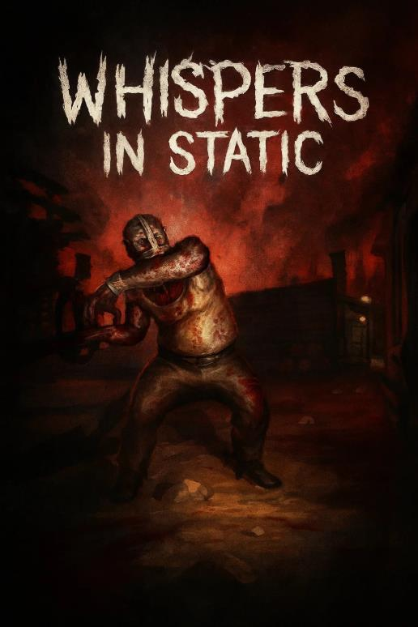
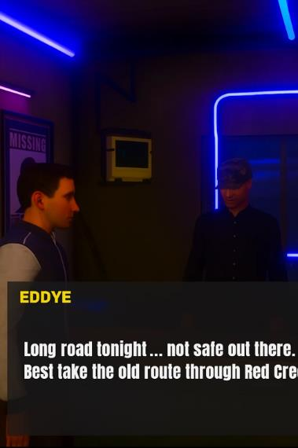
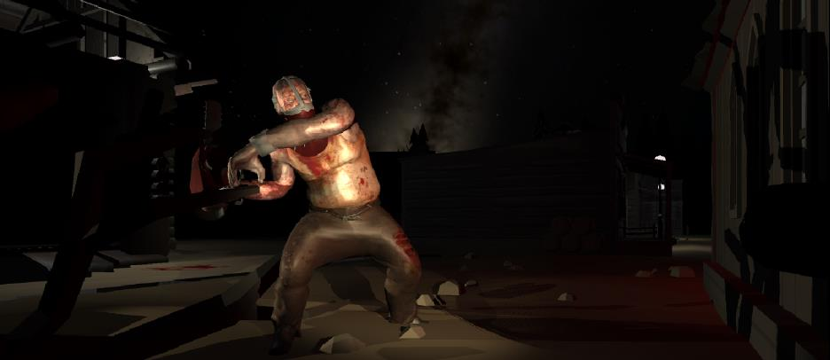

# Whispers in the Static

**A Psychological Road Horror Experience**

> What happens when a totally normal road trip goes horribly, horribly wrong?

**Whispers in the Static** is a first-person psychological horror game about a late-night drive that spirals into a nightmare — a gas station owner whose smile doesn't reach his eyes, two eerily synchronized hitchhikers, and the buried legacy of a human experiment called *Static Whisper*. It's built in Unity with the XR Interaction Toolkit: fully playable on desktop today, and designed from day one to move into VR.

This isn't a jump-scare game. It's built around atmosphere, oppressive quiet, and a dread that's still there after you've quit — inspired by the slow burn of *Route 86*, the psychological mastery of *Silent Hill 2*, and the raw powerlessness of *Outlast*.

## Table of Contents
- [Story](#story)
- [Screenshots](#screenshots)
- [Gameplay](#gameplay)
- [World](#world)
- [Characters](#characters)
- [Tech Stack](#tech-stack)
- [Controls](#controls)
- [Getting Started](#getting-started)
- [Development Process](#development-process)
- [Inspirations](#inspirations)
- [Future Improvements](#future-improvements)
- [Credits](#credits)

## Story

Ethan and his friend Caleb are driving late at night when they pass two hitchhikers standing dead still under a flickering streetlight — blank-faced, synchronized, just slightly off. Stop or drive on, it doesn't matter. The hook is already in.

At the only gas station for miles, the owner seems friendly enough, but insists they take a "long scenic route" through the woods to avoid a crash up ahead. Through the window, the same two hitchhikers are watching from another car.

That night, the radio dissolves into static, a tire blows, and the car slides into a ditch — spikes laid deliberately across the road. With no way forward, Ethan and Caleb head into the woods and stumble on a town being consumed by fog and static. Whispers ride the airwaves, warping what's real. Scattered files and audio logs piece together *Static Whisper*, a behavioral experiment run by the gas station owner to study raw fear — and its test subjects, including the disfigured thing now stalking the town: **The Butcher**.

The final twist: Ethan and Caleb were never just passing through. They're the next subjects. Now they have to piece together the truth and get out before they become another whisper in the static.

## Screenshots

*Eddye, the gas station owner, steers you toward "the old route through Red Creek."*

*The Butcher — silent, brutal, and scariest when he's nowhere in sight.*

## Gameplay

- **Exploration & environmental storytelling** — the world tells the story; you piece it together.
- **Stealth over combat** — no weapons. Survival means observation, movement, and staying hidden from The Butcher.
- **Collectible lore** — letters, tapes, and photos build out the *Static Whisper* backstory.
- **Diegetic UI** — no health bar, no pop-ups. If you want to read a note, you pick it up and read it.
- **Reactive AI** — The Butcher patrols, chases, and searches on a NavMesh, with sound detection feeding into the stealth loop.

## World

| Zone | What it's about |
|---|---|
| **The Road** | The opening stretch — alone, exposed, nowhere to hide. |
| **The Gas Station** | A tiny island of light that never quite feels safe. |
| **The Town** | The main hub — an open, foggy maze of clues and fraying reality. |
| **The Shack** | A rare quiet beat to breathe and catch up on the story. |
| **The Underground Facility** | Where the experiment's true, sickening scope comes out. |
| **The Maze** | Less a level than a metaphor — total loss of control. |

Pacing deliberately alternates between tense silence and chaos, so you never settle into a safe rhythm.

## Characters

- **Ethan (Player)** — confident he's too smart to be scared. That doesn't last.
- **Caleb** — Ethan's friend and anchor to reality; his fate depends on how you play.
- **The Hitchhikers** — synchronized and soulless, a symbol of stolen free will.
- **Eddye, the Gas Station Owner** — the scientist behind *Static Whisper*, and the spider at the center of the web.
- **The Butcher** — not a supernatural demon, but what's left of a man after being turned into a test subject. Silent, brutal, and a vision of what you could become.

## Tech Stack

| System | Details |
|---|---|
| Engine | Unity 6 |
| Rendering | Universal Render Pipeline (URP) |
| VR Framework | XR Interaction Toolkit (XR Origin, XR Device Simulator, XR Input Actions) |
| Environment | Modular assets + Unity terrain tools, baked lighting |
| Audio | 3D spatial audio with reverb zones |
| AI | NavMesh Agents with patrol / chase / search states, plus sound detection |
| Events | Unity event scripts driving cutscenes and triggers |
| Optimization | Baked lighting, occlusion culling, LODs |

The project is built entirely on the XR Interaction Toolkit — head tracking, locomotion, and grab interactions are already wired up — so it runs today on keyboard and mouse via the XR Device Simulator, and is ready for real VR hardware without reworking the core systems.

## Controls

Desktop / simulation mode (no headset required):

| Input | Action |
|---|---|
| `WASD` / Arrow Keys | Move (simulates VR thumbstick locomotion) |
| Mouse | Look around (simulates headset rotation) |
| Virtual controller buttons (via XR Input Actions) | Grab, activate, and inspect objects |

## Getting Started

1. **Clone** this repository.
2. **Open** the project in Unity Hub — built on **Unity 6** *(fill in your exact editor version here)*.
3. **Open the main scene** and press **Play**.
4. No headset needed to test — the project ships with the **XR Device Simulator**, so keyboard and mouse fully simulate VR head tracking, locomotion, and grabbing.
5. To run on real hardware, connect a compatible VR headset/controllers — the XR Interaction Toolkit bindings carry over without extra setup.

> Steps 2–3 are a starting template based on the project's technical notes — update them with your actual scene path once the repo is organized.

## Development Process

Built solo in **3 weeks** across **7 major builds**.

| Week | Focus | Key Tasks |
|---|---|---|
| 1 | Narrative & Level Concepts | Map layout, lighting prototypes, asset collection |
| 2 | Core Mechanics | Player movement, flashlight, sound logic |
| 3 | Sound & Polish | Audio tuning, performance optimization, playtesting |

Every build asked the same questions: Does this feel right? Is the lighting creepy enough? Is the AI too dumb, or too smart? Playtester feedback drove most of the tuning — one tester describing a "growing sense of doom" was the sign the atmosphere was landing.

## Inspirations

- **Route 86** — lonely, Americana dread
- **Silent Hill 2** — psychological horror as a genre benchmark
- **Outlast** — powerlessness as a core mechanic
- **The Texas Chainsaw Massacre** — gritty, grounded terror
- **SOMA** — existential dread

## Future Improvements

- Full voice acting
- Dialogue choices with real narrative weight
- Smarter, less predictable AI
- A stress system (e.g. an audible heartbeat under pressure)
- A full VR hardware pass beyond the XR Device Simulator

## Credits

Designed and built by **Keshav Sanjay Kadale**
Course: *Virtual and Augmented Reality Systems (CS560)*
Instructor: **Dr. Samit Bhattacharya**

---

*This project was built as a course submission. If you plan to share the repository publicly, consider adding a [license](https://choosealicense.com/) file.*
